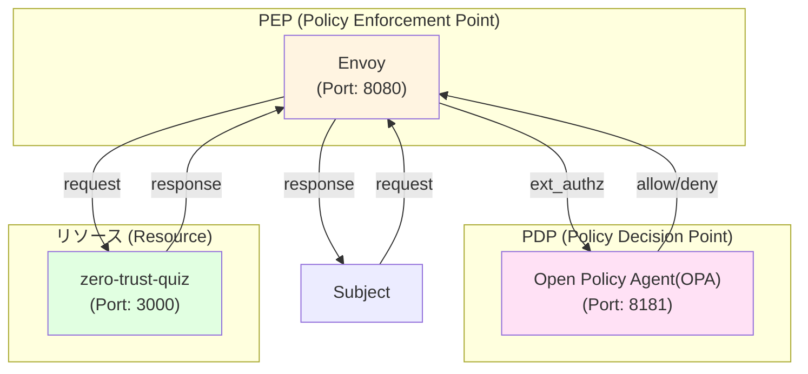

# Zero Trust Architecture

ゼロトラストアーキテクチャは、以下の文献が参考になります。

- [NIST SP 800-207: Zero-Trust Architecture](https://doi.org/10.6028/NIST.SP.800-207)
- [NIST SP 1800-35 Implementing Zero-Trust Architecture: High-Level Document](https://doi.org/10.6028/NIST.SP.1800-35)

オープンソースソフトウェアのみを使用してゼロトラストアーキテクチャを実現します。
参照図の各論理コンポーネントを具体的なOSS候補にマッピングし、すべての要素をカバーする最小限のスタックを提供します。

## 論理コンポーネントとOSS候補

### PEP(Policy Enforcement Point)

- 最小構成: Envoy (ext_authz、JWT、mTLS)
- 拡張: Lua搭載NGINX/OpenResty、認証プラグイン搭載Caddy

### PDP(Policy Decision Point) / Policy Engine / Policy Administration

- 最小構成: Open Policy Agent (OPA)
- 拡張構成: OPAL (ポリシー配布と同期)
- 使用: Open Policy Agent (OPA)

### PIP (Policy Information Point)

- 最小構成: OpenSearch (属性/ログ集約)、PostgreSQL (属性ストア)
- 拡張: Redis (セッション/属性キャッシュ)、Elasticsearch OSS
- 使用: OpenSearch

### ICAM(Identity, Credential, Access Management)

- 最小構成：Keycloak（OIDC/SAML、MFA、LDAP連携、RBAC）
- 拡張: FreeIPA (IdM/PKI/LDAP)、Authelia (軽量SSO)

### Subject

- 最小構成: Wazuh (HIDS/EDR型テレメトリ、FIM、脆弱性監視)
- 拡張: Osquery (エンドポイント状態管理)、Falco (ランタイム検知)
- 使用: Fleet

### Resource

- 使用: zero-trust-quizアプリケーション

## Docker Compose構成図

本プロジェクトで使用しているツール類とその関係性を以下に示します。

## 注意事項

- 本PoCは、全コンポーネントの機能カバレッジに焦点を当てており、
  本番環境レベルのスケールや可用性には対応していません。
- ゼロトラスト制御を適用するため、mTLS、JWT検証、外部認証を
  PEPで有効化する必要があります。
